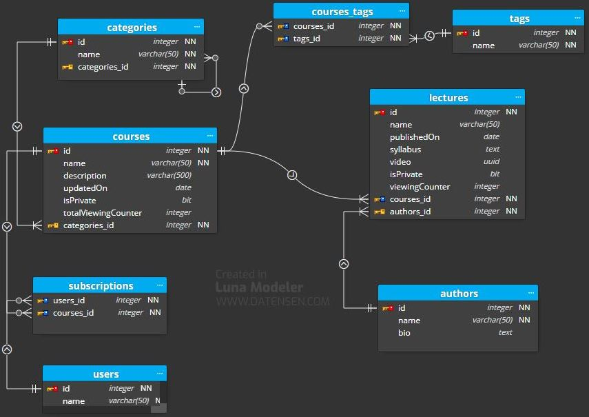

# Relational data modelling exercise 

(must) Generate a model that reflects the following requeriments:

1. Show the latest courses published. 
2. Show the courses per category (devops / front End ...).
3. Show a course and its lectures. 
4. For a lecture, show its author. 


(optional) Add to the previous model the following requeriments:

5. Add the following structured hierarchical/classified category data:
   ```
   Front End >> React
   Front End >> React >> Testing
   Front End >> Angular
   Devops >> Docker
   Devops >> Serverless
   Backend >> nodejs
   Backend >> nodejs >> Express
   Backend >> mongo
   ```
6. There might be public and private lectures, that means:
   * A course can be 100% public.
   * A course can have an initial part 100% public, and another only for subscriptors. 
   * This implies there will be registered users and subscriptions.

(challenge) Add to the previous model the following requeriments:
7. We could have subscriber users and users that only take specific courses.
8. We could add some tags in every course or lecture to allow quicker searches.
9. We could show how many times every video has been viewed. It is not needed this value to be in real time calculated.
10. We could show how many times all the videos of a course have been viewed. It is not needed this value to be in real time calculated.


## Solution structure 

```
├── er-model
│   ├── elearningPortalRelational.dmm 
│   ├── elearningPortalRelational.JPG 
│   ├── README.md
├── README.md
```

## Relational schema design in Luna Modeler 

This is the `Entity–relationship Diagram - ERD` in Luna Modeler for the mandatory requirements (eLearningPortalRelational.dmm file).


## Reasoning in the schema design
In the above e-portal application's model, these are the relationships I've identified:

### Relationship categories - courses
   One-to-many: A category (parent table) might have multiple courses (child table). In `categories` collection the `name` is an unique constraint to allow only a single row with the same value for the indexed key. 

   One-to-one: One course belongs to only one category. The `courses` collection stores all courses. In the normalized data model, each course contains a reference to the category for which it was written.
    
   ```
   // categories collection
   {
      id: "1", 
      name: "Back End"
   }
   ```

   ```
   // courses collection
   {  
      id: "1", 
      name: "C# Basics for Beginners: Learn C# Fundamentals by Coding",
      description: "Master C# fundamentals in 6 hours - The most popular course with 50,000+ students, packed with tips and exercises.",
      updatedOn: ISODate ("2022-01-21"),
      categories_id:  "1"
   }
   ```
      
   * Query to get only the category's five most recent courses, which are sorted in reverse chronological order. 

   Because the application frequently retrieves the courses data with the category name information, then it needs to issue the join query to resolve the reference. 


   ```
   SELECT TOP 5 co.name, co.syllabus, co.lastUpdated, ca.name
   FROM categories AS ca 
   INNER JOIN courses AS co ON ca.id = co.categories_id
   ORDER BY co.updatedOn DESC
   ```

   From a performance standpoint, an index on categories_id column in courses table, used in the sql join, would be beneficial. And including the updatedOn column used in order by.

### Relationship authors - lectures
   One-to-many: An author might have many lectures. 
   In `authors` collection the `name` is an unique constraint to allow only a single row with the same value for the indexed key. 

   One-to-one: One lecture is created by one author. 
   Each lecture contains a reference to the author who created it. 
   

   ```
   // Authors collection     
   {
      _id: 1,
      name: "Robert C. Martin",
      bio: "Desarrollador, ponente, formador y escritor, más de 15 años de experiencia en proyectos internacionales, apasionado del open source"
   }
   ```

   From a performance standpoint, an index on authors_id column in lectures table would be beneficial.


   If you use multiple columns for an index key, it is also essential to consider their position in the index key.

### Relationship courses - lectures
   Composite relationship (one-to-many): One course could contain many lectures. 
   One-to-one: One lecture belongs to only one course. The primary key of each lecture is a composite one made by the combination of the lecture id and the course id for which it was written.
   
   Composite aggregation (composition) is a "strong" form of aggregation with the following characteristics:
   * it is binary association,
   * it is a whole/part relationship,
   * a part could be included in at most one composite (whole) at a time, and
   * if a composite (whole) is deleted, all of its composite parts are "normally" deleted with it.
   
   ```
   //Lectures table
   {
      _id: "10",
      courses_id: "1",
      name: "Clean Code",
      video: objectId("111f1f17bcf86cf123456789"),       
      publishedOn: ISODate ("2008-04-20"),
      authors_id: "1"      
   }
   ```

### Relationship categories - lectures
   One-to-many: A category might have multiple lectures documents. This is done through courses. A category might have multiple courses. One course could contain many lectures.
   One-to-one: One lecture belongs to only one category. This is done through courses. One Lecture belongs to only one course. One course belongs to only one category.
        

### Relationship courses - authors
   One-to-many: A course might be created by more than one author. This is done through lectures. One lecture is created by one author. 
     
   One-to-many: An author might participate in many courses. This is done through lectures.
   An author might have many lectures. 
   

### Relationship categories - categories
   To meet the first optional requirement to have an structured hierarchical category, I've used the Asymmetric Reflexive Association.
   One-to-many: A category (parent) might have zero or many sub-categories (child).
   One-to-one: A subcategory (child) belongs to zero or  only one category (parent). 
   
   A reflexive association is an association between instances of the same class.
   Asymmetric Reflexive Associations: The ends of the association are semantically different from each other, even though the associated class is the same. Examples include parent-child, supervisor-subordinate and predecessor-successor.
   Also it is necessary to ensure that the lower bound is always zero on both ends. The reason for this is that otherwise an illogical situation would arise: For example, if you said that each category must have one or more sub-categories, then what about the very last categories in the hierarchy? 
  
   ```
   Backend >> nodejs
   Backend >> nodejs >> Express
   Backend >> mongo
   ```
    
   ```
   // categories collection
   {
      id: "1", 
      name: "Back End",
      categories_id: "1"
   }
   {
      id: "2", 
      name: "node js",
      categories_id: "1"
   }
   {
      id: "3", 
      name: "Express",
      categories_id: "2"
   }
   ```
   

### Relationship users - courses
   To meet the second optional requirement to have public and private lectures, we need  to add a new bool column isPrivate, by default false, to lectures and courses tables.
   
   To have registered users, we need a new table, users. Here is the relationship involved between users and courses:
   Many-to-Many: A user might subscribe to zero or many courses. One course might be taken by zero or many users.
   The zero cardinality meets the first challenge requirement to have users that might not have any suscription, but might take specific courses.

   To model Many-to-Many in the database is to create a new table, subscriptions, the associative table. The associative table sits between the two entities in a many-to-many relationship and actually has a one-to-many relationship with each. That is, given tables A and B and an associative table C, A has many Bs through C and B has many As through C; put another way, A has many Cs, B has many Cs, but C has one A and one B.
      
   Notice that we specified two foreign keys on this table, courses_id and users_id, pointing to the courses and users tables respectively.

   Now, there will be a record in the subscriptions table for every course an user is subscribed to. As a result, there will also be a record in the subscriptions table for every user that subscribes a course.

### Relationship courses - tags
   To meet the second challenge requirement to have tags in every course or lecture, I've created a new table tags. 
   Many-to-Many: A course might have zero or many tags. One tag migt be used in one or many courses.

To meet the third challenge requirement to have video viewing's counters I´ve created a new column `ViewingCounter` in lectures table to track how many times that video is watched.

To meet the fourth challenge requirement to count how many times all the videos of a course have been viewed I´ve created a new column `TotalViewingCounter` in courses table. The value of that column will be calculated (SUM ViewingCounter).