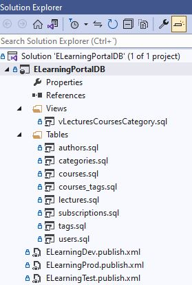
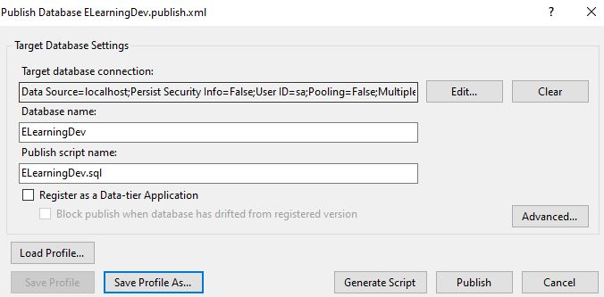
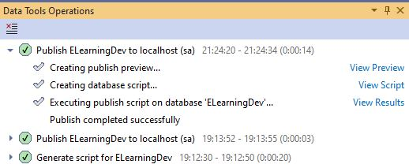

# Relational module 1 exercise - Advanced (Optional)
Based on the data modelling exercise:
* Create a sql server database project in Visual Studio with the data tables structure.
* Create some publish profiles (.pubxml files) to allow for multiple project configurations and multiple publish targets (dev, test, production).
* Create a view to simplified the queries, joining some tables and or filters.


## Solution structure 

```
├── db-project
│   ├── ELearningPortalDB 
│   	├── Tables
│   		├── authors.sql
│   		├── categories.sql
│   		├── courses.sql
│   		├── courses_tags.sql
│   		├── lectures.sql
│   		├── subscriptions.sql
│   		├── tags.sql
│   		├── users.sql
│   	├── Views
│   		├── vLecturesCoursesCategory.sql
│   	├── ELearningPortalDB.sln
│   	├── ELearningPortalDB.sqlproj
│   	├── ELearningDev.publish.xml
│   	├── ELearningTest.publish.xml
│   	├── ELearningProd.publish.xml
│   ├── ELearningDev.publish.sql
│   ├── ELearningDropTables.sql
│   ├── README.md
│   ├── dev-publish-profile
├── dev-publish-profile.JPG
├── eLearningDev-Database.JPG
```

## View and simplification

```
CREATE VIEW [dbo].[vLecturesCoursesCategory]
AS
SELECT        
	dbo.categories.name AS [CategoryName], 
	dbo.courses.name AS [CourseName], 
	dbo.courses.updatedOn AS [CourseUpdatedOn], 
	dbo.lectures.name AS [LectureName], 
    dbo.lectures.publishedOn AS [LecturePublishedOn], 
	dbo.authors.name AS [AuthorName]
FROM 
	dbo.categories 
    INNER JOIN dbo.courses 
            ON dbo.categories.id = dbo.courses.categories_id 
	INNER JOIN dbo.lectures 
            ON dbo.courses.id = dbo.lectures.courses_id 
	INNER JOIN dbo.authors 
            ON dbo.lectures.authors_id = dbo.authors.id
```

I can query this view like this:
```
SELECT 
	V.CourseName,
	V.CourseUpdatedOn,
	V.CategoryName,
	V.LectureName, 
	V.LecturePublishedOn,	
	V.AuthorName
FROM dbo.vLecturesCoursesCategory AS V
WHERE V.LectureName LIKE 'Clean Code'
ORDER BY V.CourseUpdatedOn DESC
```

## ELearning database project structure

 

## Publish a database project
 1. Right-click the ELearnigPortalDB project in Solution Explorer and select Publish. SSDT will start building your project. If there is no build error, the Publish Database dialog box appears.
 In the Publish Database dialog box, click Edit to edit the Target database connection.

2. In the Connection Properties dialog box, enter your SQL Server instance name and your credentials for authentication. In Connect to a database, enter `ELearningDev`. This will attempt to publish your database project to a new database. You can also choose an existing database to publish to, so that all the changes you have been making to the objects (as scripts) in the offline `ELearningPortalDB` project will be propagated to the live `ELearningDe` database.

    

    If you have permission to make any changes to the database you want to publish to, press the Publish button. If, however, you do not have write access to a production database, you can click the Generate Script button to produce a Transact-SQL publish script,`ELearningDev.publish.sql`, which can then be handed off to a DBA. The DBA can then run the script to update the production server so that its schema is in sync with the database project.

      

3. The Data Tools Operations window will show the progress of your publish operations, and notify you of any errors. In this new window, you can also choose to view the deployment preview, the generated script `ELearningDev.publish.sql`, or the full publish results if desired.

    

4. You can also save the publish settings in a profile, so that you can reuse the same settings for future publish operations. To do so, click the Save Profile As button in the Publish Database dialog box to produce `ELearningDev.publish.xml`. In the future, you can click the Load Profile button when you want to reload existing settings.