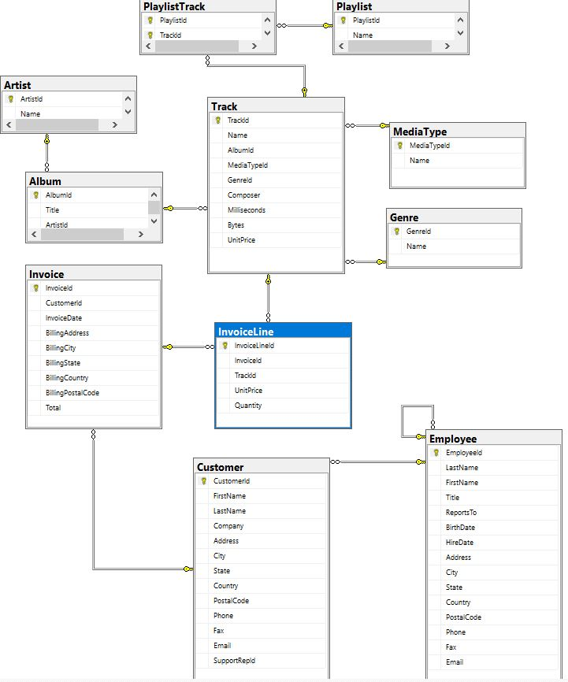

# Introduction
This repository presents the solution to the lab provided by the Bootcamp Backend Lemoncode for the Module Relational - Sql Server.

The tech stack is SQL Server Management / Azure Data Studio, Microsoft Transact-SQL (T-SQL) and Docker.

# Restore a SQL Server database in a Windows Docker container
1.  Run the container image
    First we need to run a SQL Server server in our host machine. To run the container `mcr.microsoft.com/mssql/server:2017-latest-ubuntu` image with Docker, you can use the following command:
    ```Bash
    docker run -e "ACCEPT_EULA=Y" \
    -e "SA_PASSWORD=<YourStrong!Passw0rd>" \
    -e "MSSQL_PID=Express" \
    -p 1433:1433 \
    --name sqlserver \
    -d mcr.microsoft.com/mssql/server:2017-latest-ubuntu
    ```
    This command creates a SQL Server 2017 container with the Developer edition (default). SQL Server port 1433 is exposed on the host as port 1433.
    
    To view your Docker containers, use the docker ps command.
    

2. Copy a backup file into the container
   Download the `LemonMusic.bak` backup to your machine. Once downloaded, use docker cp to copy the we need to copy the backup file into the container in the /tmp directory.
    `docker cp ./LemonMusic.bak sqlserver:/tmp`
3. Restore from the following backup `LemonMusic.bak`.
    The backup file is now located inside the container. 
    The following [link](https://github.com/Lemoncode/bootcamp-backend/tree/main/01-stack-relacional/01-sql-server/06-restore-sample-database) show you the steps to do it via SQL Server Management Studio


# SQL Server exercise
This is the `Entity relationship Diagram - ERD` in SQL Server Management Studio.


### Essential queries
Create a `consultas.script.sql` file and resolve the following queries:
1. Select the tracks with price greater than or equal to $1
2. Select the tracks with more than 4 minutes long
3. Select the tracks between 2 and 3 minutes long
4. Select the tracks where one of its composers is Mercury
5. Calculate the average track length of the plataform
6. Select the customers from USA, Canada and Brazi
7. Select all the tracks from Queen
8. Select the Queen's tracks where David Bowie has participated as compositor
9. Select the tracks of 'Heavy Metal Classic' playlist
10. Select the playlists with its number of tracks
11. Select the playlists (distinct) that have any song from AC/DC
12. Select the playlists that have any song from 'Queen' along with the quantity
13. Select the tracks that are not on any playlist
14. Select the artists that don't have any album
15. Select the artists with their number of albums
    To ensure whether the query is correct or not, some of the artists from the previous query (artists without album) should be displayed with 0 albums

### Optional queries
Create a `consultas-extra.script.sql` file and resolve the following queries:
1. Select the tracks order by the number of times that appear in playlists in descending mode
2. Select the bestseller tracks (the InvoiceLine table has got the purchase record)
3. Select the bestseller artists
4. Select the tracks not bought yet
5. Select the artists that have not sold any track